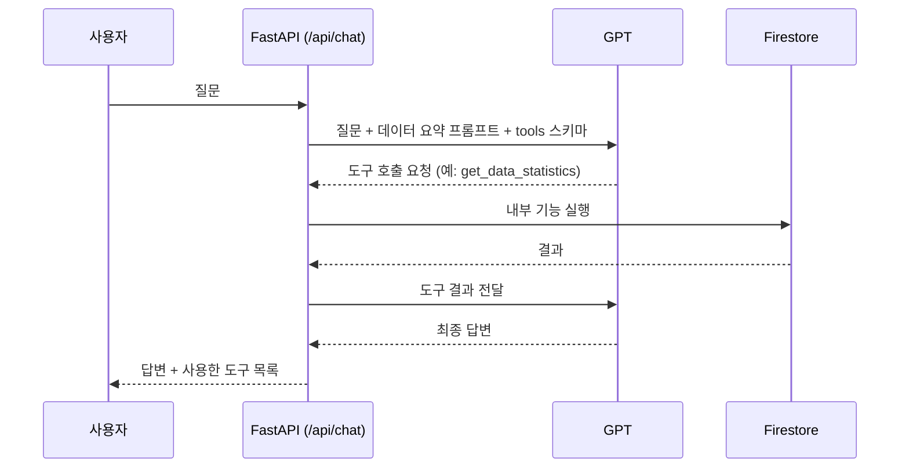

# 📊 AI Agent Mission — 나만의 AI 비서


시계열 데이터(계약서 발송·서명 현황)를 분석해 요약 정보를 생성하고, 이를 시스템 프롬프트에 주입해 대화하는 AI 비서 웹 서비스입니다. FastAPI 백엔드와 바닐라 HTML/CSS/JS 프론트엔드로 구성되어 있으며, 데이터는 Firebase Firestore에 저장하고 대화 응답은 OpenAI 호환 API를 통해 생성합니다.

## ✨ 주요 기능

- **AI 챗봇**: 계약서 발송·서명 현황 데이터 요약을 컨텍스트로 주입해 질문에 답변, 대화 history 유지
- **데이터 관리(CRUD)**: 날짜별 신규계약 건수 데이터 조회/등록/수정/삭제
- **대화기록 관리**: 대화 목록 조회, 상세 로그 확인, 삭제

## 🛠 기술 스택

| 구분 | 기술 |
|---|---|
| 백엔드 | FastAPI, Python 3.12 |
| 데이터베이스 | Firebase Firestore |
| AI | OpenAI 호환 API (코디세이, gpt-5-mini) |
| 프론트엔드 | HTML / CSS / Vanilla JS |
| 배포 | 백엔드 Render, 프론트엔드 Vercel |

## 📁 폴더 구조

```
ai-agent-mission/
├── main.py                # FastAPI 엔트리포인트
├── routers/
│   ├── data.py             # 데이터 CRUD 라우터
│   └── chat.py             # 대화기록 + 챗봇 라우터
├── services/
│   └── ai_service.py        # AI 호출 및 컨텍스트 구성 로직
├── requirements.txt
├── requirements.lock.txt
└── frontend/
    ├── index.html           # 챗봇 화면
    ├── data.html            # 데이터 관리 화면
    ├── history.html          # 대화기록 화면
    ├── css/style.css
    └── js/
        ├── config.js
        ├── api.js
        ├── chat.js
        ├── data.js
        └── history.js
```

## 🚀 설치 및 실행 방법

### 백엔드

```bash
git clone https://github.com/FlyingTurtles07/ai-agent-mission.git
cd ai-agent-mission

python -m venv venv
venv\Scripts\activate        # Windows
# source venv/bin/activate   # macOS/Linux

pip install -r requirements.lock.txt

# .env 파일 작성 후 (아래 환경변수 안내 참고)
python -m uvicorn main:app --reload
```

Swagger UI 확인: `http://127.0.0.1:8000/docs`

### 프론트엔드

```bash
cd frontend
python -m http.server 5500
```

브라우저에서 `http://127.0.0.1:5500` 접속 (로컬 실행 시 `js/config.js`가 자동으로 `http://127.0.0.1:8000` 백엔드를 바라봅니다.)

## 🔑 환경변수 (.env)

```env
FIREBASE_CREDENTIALS_JSON=<Firebase 서비스 계정 JSON 내용 또는 경로>
CODYSSEY_API_KEY=<코디세이 발급 API 키>
CODYSSEY_BASE_URL=<코디세이 OpenAI 호환 base url>
AI_MODEL=gpt-5-mini
```

## 📡 API 명세

### 데이터 CRUD

| 메서드 | 경로 | 설명 |
|---|---|---|
| GET | `/api/data` | 전체 데이터 목록 조회 |
| GET | `/api/data/summary` | 데이터 요약 통계 조회 (count, 평균, 표준편차 등) |
| POST | `/api/data` | 데이터 등록 |
| PUT | `/api/data/{id}` | 데이터 수정 |
| DELETE | `/api/data/{id}` | 데이터 삭제 |

### 대화기록

| 메서드 | 경로 | 설명 |
|---|---|---|
| POST | `/api/conversations` | 새 대화 생성 |
| GET | `/api/conversations` | 대화 목록 조회 (내림차순) |
| GET | `/api/conversations/{id}` | 대화 상세(메시지 로그) 조회 |
| DELETE | `/api/conversations/{id}` | 대화 삭제 |

### 챗봇

| 메서드 | 경로 | 설명 |
|---|---|---|
| POST | `/api/chat` | 메시지 전송, 데이터 요약 컨텍스트 주입 후 AI 응답 반환 |

## ☁️ 배포 정보

- **백엔드**: Render — `https://ai-agent-mission.onrender.com`
- **프론트엔드**: Vercel — `ai-agent-mission.vercel.app` <br/> 저장소 루트가 아닌 `frontend` 폴더를 Root Directory로 지정해 정적 배포
- Vercel 배포 시 Framework Preset은 **Other**로 설정 (Python 백엔드 코드 자동 감지 방지)
```

---

## 🧰 보너스: AI 도구 호출 (Function Calling) + GPT Actions

### 도구 목록과 호출 근거

GPT가 질문을 보고 필요한 도구를 스스로 고릅니다. 서버는 `tools`에 정의된 설명(description)을 근거로 GPT가 선택한 도구를 실행하고, 그 결과를 다시 GPT에 전달합니다. 사용한 도구는 응답의 `tools_used`와 채팅 화면의 🔧 배지로 확인할 수 있습니다.

| 도구 | 언제 호출되나 (근거) | 내부 기능 |
|---|---|---|
| `get_data_summary` | 기간·평균·최대/최소·추세를 물을 때 | `/api/data/summary` |
| `get_data_statistics` | 최근 흐름, 이동평균을 물을 때 | `/api/data/statistics` |
| `list_conversations` | 이전 대화 목록을 물을 때 | `/api/conversations` |
| `get_conversation` | 특정 이전 대화 내용을 물을 때 | `/api/conversations/{id}` |

### 호출 흐름



1. 서버가 GPT에 질문과 도구 스키마를 함께 보냅니다.
2. GPT가 도구가 필요하다고 판단하면 도구 이름과 인자를 반환합니다.
3. 서버가 해당 내부 기능을 실행해 결과를 GPT에 돌려줍니다. (최대 3회 반복)
4. GPT가 결과를 바탕으로 최종 답변을 만들고, 대화가 저장됩니다.

### GPT Actions 연동 (외부 채널)

동일한 조회 기능을 ChatGPT의 Custom GPT에서 호출할 수 있습니다.

1. ChatGPT에서 GPT 만들기 → Configure → Actions → Create new action
2. `actions_openapi.yaml` 내용을 붙여넣기 (서버 주소는 Render 배포 URL)
3. Authentication은 None (읽기 전용 공개 API)
4. Test로 `getDataSummary`, `getDataStatistics` 호출 확인
5. 대화창에서 "최근 7일 이동평균이 어때?" 질문 → GPT가 `getDataStatistics`를 호출하는지 확인

> Render 무료 티어는 첫 요청이 느릴 수 있어 Actions 첫 호출이 지연될 수 있습니다.

### 인사이트·UX

- `GET /api/data/statistics`: 일별 값과 최근 7일 이동평균(최근 7개 데이터 포인트 기준) 제공
- 데이터 관리 화면: 요약 카드, 추이 그래프(Chart.js), JSON 다운로드
- 전체 화면 다크/라이트 모드 토글